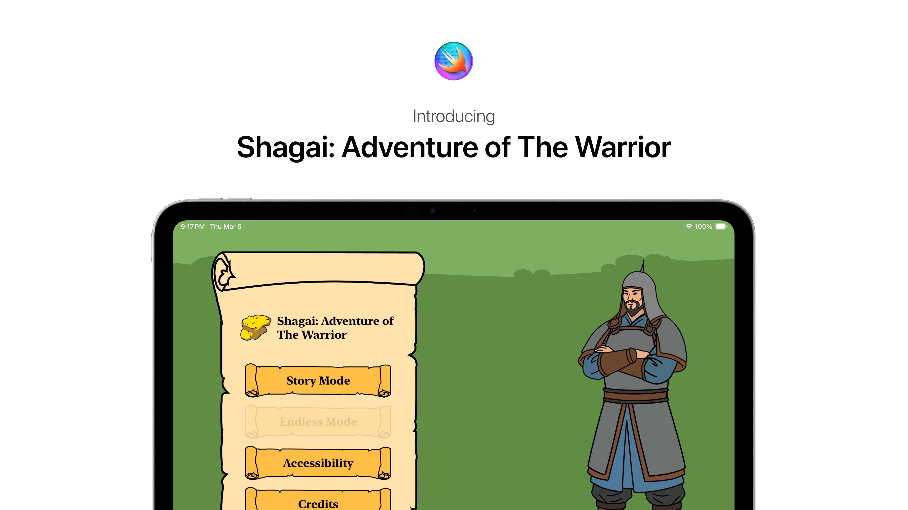
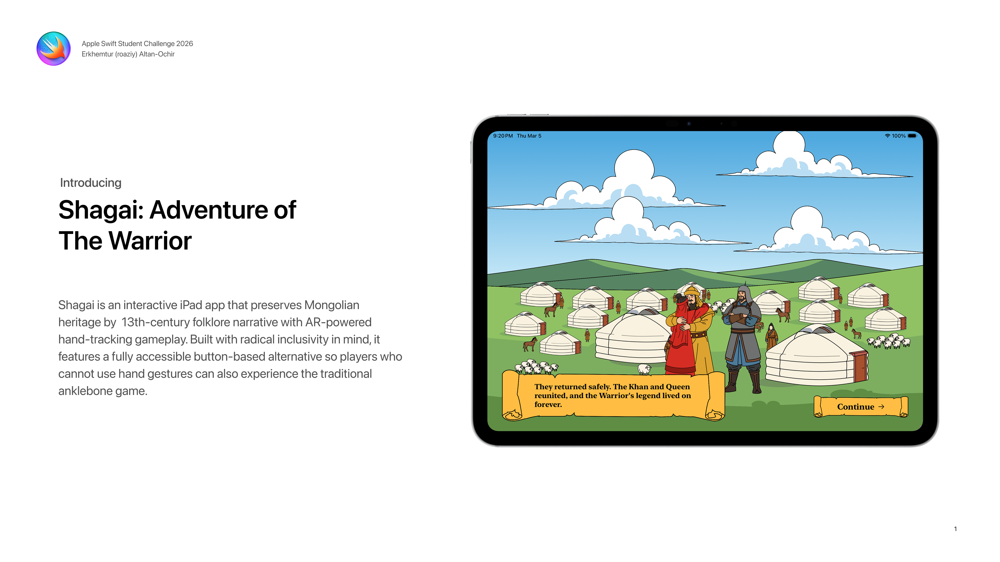
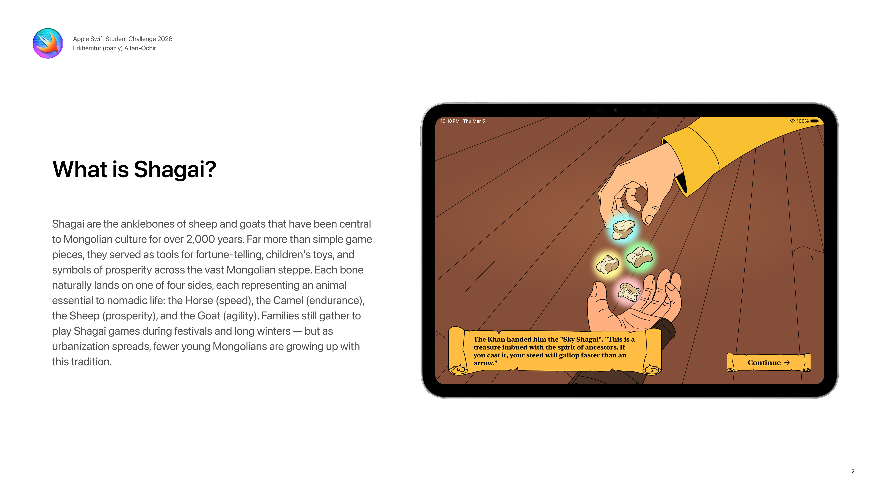
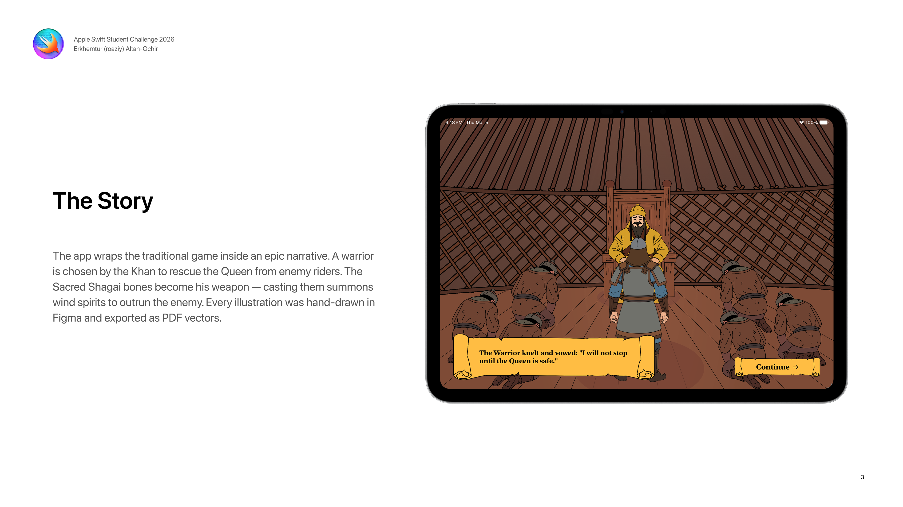
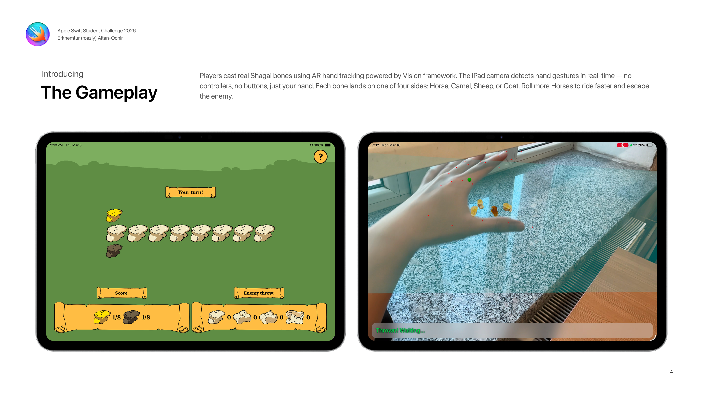
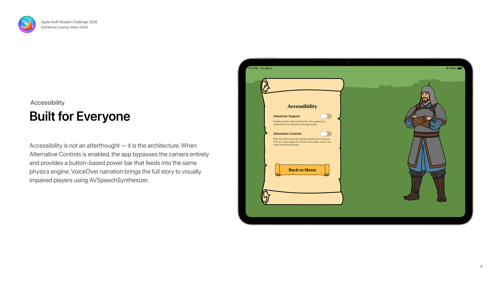
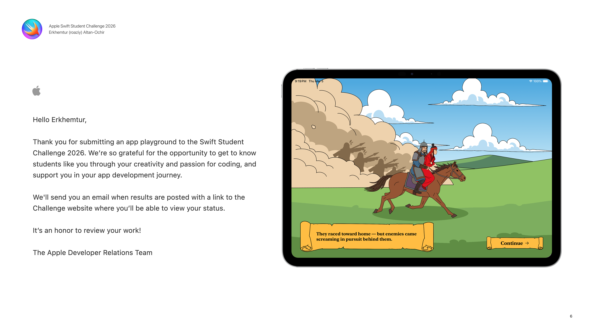

# 🏇 Shagai: Adventure of The Warrior

An interactive iPad game that preserves Mongolia's 2,000-year-old **Shagai** tradition through AR hand-tracking gameplay and cinematic storytelling. Built entirely in Swift Playgrounds as an Apple Swift Student Challenge 2026 submission.

---

## 🌍 The Problem

Shagai — the traditional Mongolian game played with sheep anklebones — has been a cornerstone of nomadic culture for over two millennia. It was once a game every child grew up playing on the open steppe. But as urbanization accelerates and screen time replaces outdoor play, this living tradition faces cultural erasure. Fewer young Mongolians know the four sacred sides of the bone, and the stories tied to them are fading from memory.

**Shagai: Adventure of The Warrior** brings this heritage to life on iPad, blending real-time hand tracking with a hand-illustrated story so that anyone, anywhere, can experience the spirit of Shagai.

---

## 🦴 What Is Shagai?

**Shagai** (Шагай) are the anklebones of sheep or goats. For Mongolian nomads, these small bones are symbols of luck, prosperity, and the deep bond between humans and livestock. Each bone can land on one of four sides, each named after an animal of the steppe:

| Side         | Animal        | Meaning                  |
| ------------ | ------------- | ------------------------ |
| 🐴 **Horse** | Horse (Морь)  | Speed and freedom        |
| 🐫 **Camel** | Camel (Тэмээ) | Endurance and resilience |
| 🐑 **Sheep** | Sheep (Хонь)  | Gentleness and peace     |
| 🐐 **Goat**  | Goat (Ямаа)   | Agility and cleverness   |

In the game's **Shagai Uraldaan** (Horse Race) mode, your piece advances one step for every bone that lands on the **Horse** side. Race to the end of the track before your opponent does!

---

## 📖 Story Synopsis

> _Long ago, a Khan and Queen ruled a peaceful kingdom on the steppe. But peace didn't last — a cold wind blew from the west, and shadows began to stir._

Enemies storm the kingdom and capture the Queen. The Khan calls for his bravest warriors, and one lone Warrior steps forward, vowing: _"I will not stop until the Queen is safe."_

The Khan entrusts the Warrior with the **Sky Shagais**, ancient bones imbued with the spirit of ancestors: _"If you cast it, your steed will gallop faster than an arrow."_

Deep in enemy territory, the Warrior finds the Queen. Together they ride for home, but enemies come screaming in pursuit. You must **throw the Shagai** to outrun them in a tense Horse Race. Win, and the Warrior's legend lives on forever.

The story unfolds across **13 cinematic scenes** with hand-drawn illustrations, culminating in a playable Shagai Uraldaan that determines the ending.

---

## ✨ Key Features

- **AR Hand Tracking** — Make a fist, then open your hand in front of the camera to throw four 3D shagai bones onto a physics-enabled surface. Powered by the Vision framework and ARKit for real-time gesture recognition.
- **3D Shagai Physics** — Four textured shagai bones are simulated with RealityKit physics (mass, friction, collision). They tumble and land naturally, and the side each bone faces is read automatically.
- **Hand-Drawn Illustrations** — Every scene background, character, and UI element was designed and illustrated in Figma, then exported as PDF vectors for crisp rendering at any resolution.
- **Cinematic Storytelling** — 13 illustrated story scenes with smooth transitions, animated reveals, and optional VoiceOver narration guide you through the Warrior's quest.
- **Two Game Modes** — **Story Mode** (8-tile horse race woven into the narrative) and **Endless Mode** (10-tile standalone races, unlocked after completing the story).
- **In-Game Tutorial** — A 7-page interactive tutorial teaches the rules of Shagai Uraldaan, with visuals that adapt based on your control preference.
- **Lore Section** — After completing the story, a lore page explains the real history behind Shagai and its cultural significance.

---

## ♿ Accessibility

Accessibility is a first-class feature, configurable during onboarding or from the main menu:

| Feature                  | Description                                                                                                                                                                         |
| ------------------------ | ----------------------------------------------------------------------------------------------------------------------------------------------------------------------------------- |
| **VoiceOver Narration**  | Toggle spoken descriptions for every story panel via `AVSpeechSynthesizer`, so the entire narrative can be experienced through audio.                                               |
| **Alternative Controls** | A button-based throwing mode (`AltThrowView`) replaces hand tracking entirely. Hold a button to charge a power bar, then release to throw. Fully playable with a keyboard or mouse. |

Both options are available in the **Accessibility** menu and can be changed at any time.

---

## 🛠 Tech Stack

| Technology                | Usage                                                                                            |
| ------------------------- | ------------------------------------------------------------------------------------------------ |
| **SwiftUI**               | All UI, scene transitions, animations, and game boards                                           |
| **Vision**                | Real-time hand pose detection (`VNDetectHumanHandPoseRequest`) for fist/open gesture recognition |
| **ARKit**                 | `ARWorldTrackingConfiguration` with horizontal plane detection and ultra-wide camera support     |
| **RealityKit**            | 3D shagai bone models, physics simulation (mass, friction, restitution), and collision detection |
| **AVFoundation**          | Camera session management for the Vision pipeline                                                |
| **AVSpeechSynthesizer**   | Text-to-speech narration for accessibility VoiceOver support                                     |
| **CoreGraphics / PDFKit** | Hand-drawn PDF vector backgrounds rendered at native resolution                                  |

The entire project is a single Swift Playground App Package (`.swiftpm`) with no external dependencies.

---

## 📸 Screenshots

---

## 🚀 How to Run

### Requirements

- iPad running **iPadOS 18.1** or later (recommended for full AR hand tracking)
- **Swift Playgrounds 4.6+** on iPad

### On iPad (Recommended)

1. Clone or download this repository
2. Open `Shagai.swiftpm` in **Swift Playgrounds**
3. Grant camera access when prompted (required for hand tracking)
4. Rotate your iPad to **landscape mode** and play!

> **Note:** AR hand tracking requires a physical iPad with a camera. The simulator supports story mode and alternative controls, but not the AR throwing experience.

---

## 👤 Author

**Erkhemtur (roaziy) Altan-Ochir**

Second-year IT student at the Mongolian University of Science and Technology. Deeply inspired by the heritage of the Mongolian Empire and the traditional game of Shagai.

- GitHub: [@roaziy](https://github.com/roaziy)

---

## 📄 License

This project is licensed under the MIT License. See [LICENSE](LICENSE) for details.
